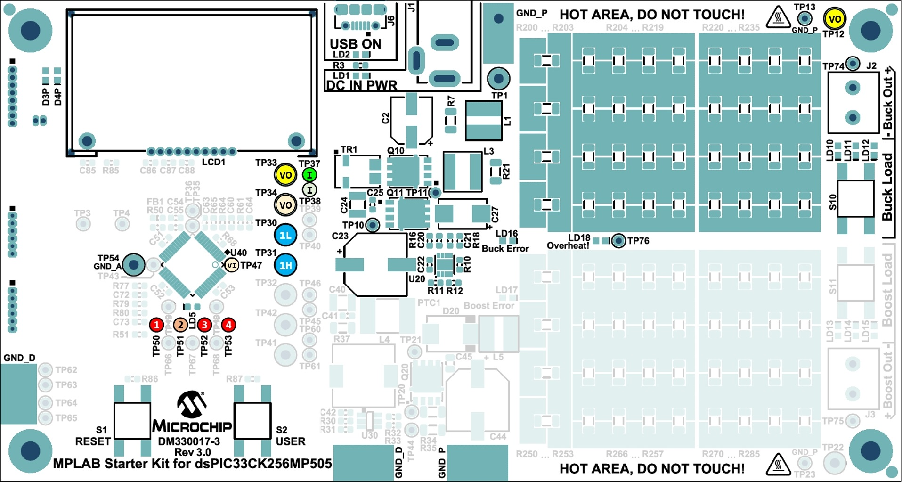

 

--- 
# dsPIC33C Digital Power Starter Kit
### Synchronous Buck Converter: Average Current Mode Control

<a target="_blank" href="https://www.microchip.com/DM330017-3" rel="nofollow">

&nbsp; 

</a>

<a target="_blank" href="https://www.microchip.com/DM330017-3" rel="nofollow">
dsPIC33C Digital Power Starter Kit (DPSK3) (Part-No. DM330017-3)
</a>

- - -

## Summary
Dual-Loop Average Current Mode Control (ACMC) example for the buck converter on the Digital Power Starter Kit, version 3 (DPSK3) featuring the dsPIC33CK family of devices.

- - -

## Description
This code example demonstrates the implementation of a dual-loop average current mode controller for the synchronous buck converter, comprised of an outer voltage loop 
and an inner current loop. The loop implementation also includes the required state machine managing board status analysis, start-up control, operation monitoring, 
fault handling and auto-restart capability. The buck converter state machine is based on a generic buck converter library package, which is configured and executed in user code.

This code example also includes the LCD driver allowing users to observe runtime data on the on-board LC display. The on-board user switch `USER` allows users to change the active display page to observe input voltage, output voltage, output current and board temperature.

## Related Documentation

#### Firmware Documentation
- [Online Firmware Documentation of this Code Example](https://microchip-pic-avr-examples.github.io/dpsk3-power-buck-average-current-mode-control/)

#### Hardware and Target Device Documentation
- [Digital Power Starter Kit 3 User Guide](https://www.microchip.com/50002867)
- [dsPIC33CK256MP508 Family Data Sheet](https://www.microchip.com/70005349)
- [dsPIC33CK256MP508 Family Silicon Errata and Data Sheet Clarification](https://www.microchip.com/80000796)

#### Please always check for the latest data sheets on the respective product websites:
- [dsPIC33CK256MP508 Family](https://www.microchip.com/dsPIC33CK256MP508)
- [dsPIC33CH512MP508 Family](https://www.microchip.com/dsPIC33CH512MP508)

## Software Used 
- [MPLAB&reg; X IDE v5.45](https://www.microchip.com/mplabx-ide-windows-installer)
- [MPLAB&reg; XC16 Compiler v1.61](https://www.microchip.com/mplabxc16windows)
- [Microchip Code Configurator v4.0.2](https://www.microchip.com/mplab/mplab-code-configurator)
- [MPLAB&reg; PowerSmart&trade; Digital Control Library Designer v0.9.14](https://microchip-pic-avr-tools.github.io/powersmart-dcld/)

## Hardware Used
- dsPIC33C Digital Power Starter Kit, Part-No. [DM330017-3](https://www.microchip.com/DM330017-3)

## Supported Target Devices

#### Focus Microchip Technology Devices
- [48-pin Digital Signal Controller, dsPIC33CK256MP505](https://www.microchip.com/dsPIC33CK256MP505)

#### Further Microchip Technology Devices used in this Design

*a) Power Supply Circuit*
- [8-MHz MEMS Oscillator, DSC6011JI2A-008](https://www.microchip.com/DSC6000B)
- [50V/1A, Asynchronous Buck Regulator, MCP16331](https://www.microchip.com/MCP16331)
- [16V/300mA Low Quiescent Current LDO with Shutdown and Power Good, 3.3V, MCP1755-330](https://www.microchip.com/MCP1755)
- [High-Speed Low-Side MOSFET Driver, MCP14A0152](https://www.microchip.com/MCP14A0152)
- [Dual Input Synchronous Half-Bridge MOSFET Driver, MCP14700](https://www.microchip.com/MCP14700)
- [High-Speed N-Channel MOSFET, MCP87130](https://www.microchip.com/MCP87130)
- [Active Thermistor Temperature Sensor, MCP9700](https://www.microchip.com/MCP9700)

*b) Protection Circuit*
- [P-Channel Enhancement-Mode MOSFET, TP2104](https://www.microchip.com/TP2104)
- [36V Open-Collector Comparator, MIC6270YM5](https://www.microchip.com/MIC6270)
- [Windowed Comparator with Adjustable Hysteresis, MIC841H](https://www.microchip.com/MIC841)
- [50V/5A Schottky-Diode, HSM560JE3](https://www.microsemi.com/existing-parts/parts/48587)

*c) Communication, Programming/Debugging and Housekeeping*
- [2-Port USB 2.0 HUB Controller, USB2422](https://www.microchip.com/USB2422)
- [USB 2.0 to I2C/UART Protocol Converter, MCP2221A](https://www.microchip.com/MCP2221A)
- [44-pin MCU PIC24FJ64GA004](https://www.microchip.com/PIC24FJ64GA004)

## Security and Safety Requirements

Unattended operating power supplies are always a potential safety risk as short circuits or failures of power components can occur at any time where even seemingly small power converters can cause fire or damage connected equipment.

* This development board has not been FCC approved nor certified and must not be used outside a laboratory environment
* Never operate the board unattended
* Only use power supplies delivered with the board or equal, approved laboratory equipment
* Read the user guide for detailed operating instructions to prevent damage to the board or connected equipment

- - -
## Setup
- Connect dsPIC33C Digital Power Starter Kit to the PC using the micro-USB cable
- Open and compile the firmware; program the target device
- Attach the 9V power supply to the board and observe the run-time values on the LC display

 
DPSK3 Buck Converter Test Points

- - -

## Operation
After the device has been programmed and the target device starts up, the LC display will show the startup screen for approx. 3 seconds before switching to the runtime data display, showing the most recent input and output voltages.
In case an appropriate power supply has been attached to the DPSK3 power input and the firmware is running correctly, the display should show an output voltage of +3.30 V DC. 

When pressing the on-board button `USER` for one second or longer, the screen can be switched between:

- Output Voltage View
- Temperature View
- Output Current View
- Firmware Version

By pressing the `Buck Load` on-board push button on the right edge of the board for ***less*** than a second, changes the static load level in four steps:

- no LED:   0% (0 mA)
- 1 LEDs:  10% (100 mA)
- 2 LEDs:  50% (500 mA)
- 3 LEDs: 100% (1000 mA)

(value accuracy +/- 10%)

By pressing the `Buck Load` on-board push button on the right edge of the board for ***longer*** than a second, the load switches into stepping mode. 

- Flashing LEDs indicate the upper step limit
- Static LEDs indicate the lower step limit

Pressing the `Buck Load` on-board push button again for ***less*** than a second, the step load can be adjusted between

- 10% to 50% Load (100-500 mA)
- 10% to 100% Load (100-1000 mA)
- 50% to 100% Load (500-1000 mA)

(value accuracy +/- 10%)

For more information, please read the [Digital Power Starter Kit 3 User Guide](https://www.microchip.com/50002867).

- - - 

&copy; 2021, Microchip Technology Inc.
